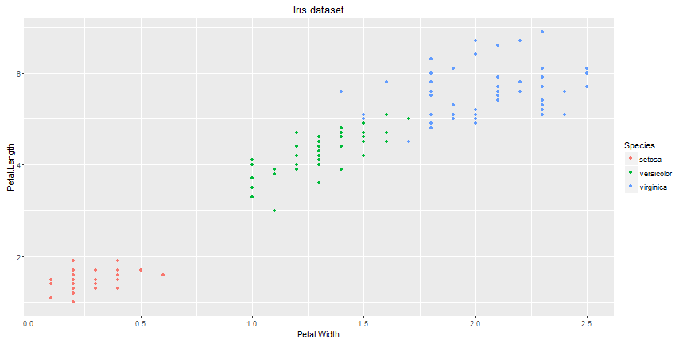

## Iris DataSet

Let's get an idea of the iris dataset. (Just the first lines from a summary...)


```
## Source: local data frame [6 x 5]
## Groups: Species [2]
## 
##      Species     variable median  mean        sd
##       (fctr)        (chr)  (dbl) (dbl)     (dbl)
## 1     setosa Petal.Length   1.50 1.462 0.1736640
## 2     setosa  Petal.Width   0.20 0.246 0.1053856
## 3     setosa Sepal.Length   5.00 5.006 0.3524897
## 4     setosa  Sepal.Width   3.40 3.428 0.3790644
## 5 versicolor Petal.Length   4.35 4.260 0.4699110
## 6 versicolor  Petal.Width   1.30 1.326 0.1977527
```

---

## Explore dataset


Looks like a k-means-algorithm(k=3) would be great to predict the species from Petal.Width and Petal.Length!

---  &submitcompare2

If you want to leave any comments to the author please write them in the box on the right side.
(Actually your text won't be send to me but feel free to write something...)

*** .explanation

Thanks for reviewing my Coursera project! Have a nice day!

--- &radio

## Final Qiuz

Did you like this presentation?

1. _yes_
2. no
3. a litte

*** .hint
The author wrote this question... the correct answer should be obvious ;-)

*** .explanation
You have to like this perfect presentation of 5 slides!!!

